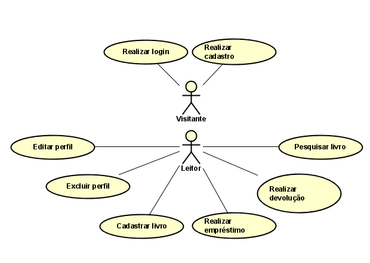

# Modelo de Casos de Uso

## 1. Diagrama de Casos de Uso

## 2. Listagem dos detalhamentos dos casos de uso

1. [CDU-001 - Realizar login](cdu-001/README.md)
2. [CDU-002 - Realizar cadastro](cdu-002/README.md)
3. [CDU-003 - Editar perfil](cdu-003/README.md)
4. [CDU-004 - Excluir perfil](cdu-004/README.md)
5. [CDU-005 - Cadastrar livro](cdu-005/README.md)
6. [CDU-006 - Realizar empréstimo](cdu-006/README.md)
7. [CDU-007 - Realizar devolução](cdu-007/README.md)
8. [CDU-008 - Pesquisar livro](cdu-008/README.md)

Recomendação de aplicação para fazer o DCU: Astah